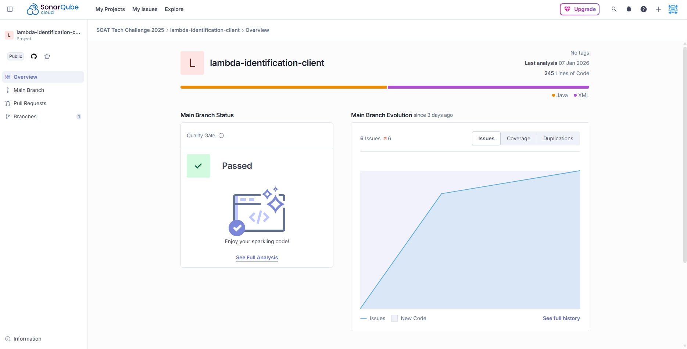

# Lambda de Clientes – DynamoDB

## Visão Geral

Esta AWS Lambda é responsável pelo **cadastro e consulta de clientes**, utilizando o **Amazon DynamoDB** como base de dados e sendo exposta via **API Gateway HTTP API (v2)**.

Ela implementa dois endpoints principais:

* **POST `/clientes`** → Criação de clientes
* **GET `/clientes/{document}`** → Consulta de cliente pelo documento

A função foi desenvolvida em **Java**, seguindo um modelo simples e direto, ideal para arquiteturas serverless.

---

## Tecnologias Utilizadas

* Java
* AWS Lambda
* API Gateway HTTP API (v2)
* Amazon DynamoDB
* AWS SDK v2
* Jackson (JSON)

---

## Recursos AWS Necessários

### DynamoDB

Tabela utilizada:

| Nome da Tabela            | Chave Primária | GSI              |
| ------------------------- | -------------- | ---------------- |
| `tc-identification-table` | `id` (String)  | `DocumentoIndex` |

**Global Secondary Index (GSI)**

| Nome             | Partition Key  |
| ---------------- | -------------- |
| `DocumentoIndex` | `nr_documento` |

---

## Estrutura dos Dados

Itens armazenados na tabela:

| Atributo       | Descrição                  |
| -------------- | -------------------------- |
| `id`           | Identificador único (UUID) |
| `nr_documento` | Documento do cliente       |
| `nm_cliente`   | Nome do cliente            |
| `ds_email`     | Email do cliente           |

---

## Endpoints

### POST `/clientes`

Cria um novo cliente na base de dados.

#### Request

**Headers**

```
Content-Type: application/json
```

**Body**

```json
{
  "document": "12345678900",
  "name": "Carlos",
  "email": "carlos@email.com"
}
```

#### Validações

* Body obrigatório
* Campos `document`, `name` e `email` são obrigatórios
* Não permite clientes duplicados pelo documento

#### Response 201

```json
{
  "message": "Cliente criado com sucesso",
  "document": "12345678900"
}
```

#### Response 400

```json
{
  "message": "document, name e email são obrigatórios"
}
```

#### Response 409

```json
{
  "message": "Cliente já existe"
}
```

---

### GET `/clientes/{document}`

Consulta um cliente pelo documento.

#### Request

**Path Param**

```
/clientes/12345678900
```

#### Response 200

```json
{
  "id": "550e8400-e29b-41d4-a716-446655440000",
  "document": "12345678900",
  "name": "Carlos",
  "email": "carlos@email.com"
}
```

#### Response 404

```json
{
  "message": "Cliente não encontrado"
}
```

---

## Códigos de Status HTTP

| Código | Descrição                    |
| ------ | ---------------------------- |
| 200    | Sucesso                      |
| 201    | Criado                       |
| 400    | Requisição inválida          |
| 404    | Não encontrado               |
| 409    | Conflito (cliente duplicado) |
| 500    | Erro interno                 |

---

## CORS

A Lambda retorna os seguintes headers CORS:

```
Access-Control-Allow-Origin: *
Access-Control-Allow-Headers: Content-Type,Authorization
Access-Control-Allow-Methods: GET,POST,OPTIONS
```

---

## Logs

São registrados nos logs:

* Método HTTP
* Path da requisição
* Mensagens de erro

Exemplo:

```
METHOD=POST
PATH=/clientes
```

## Sonar

---
